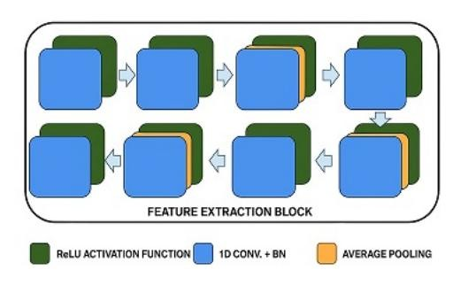
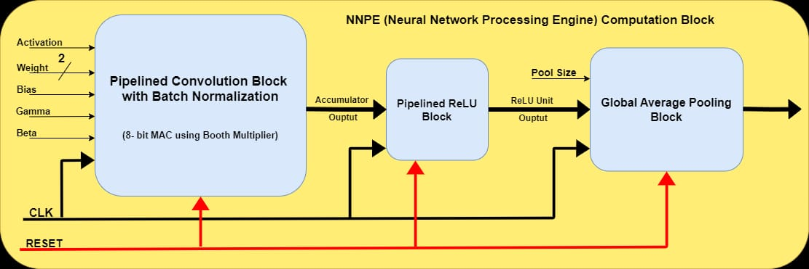
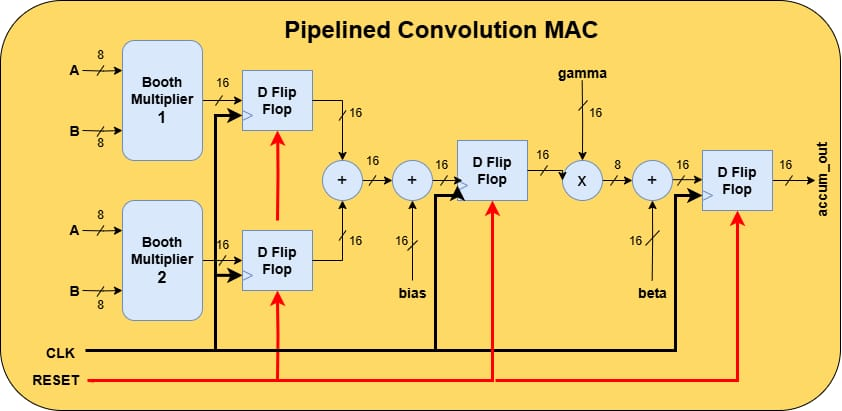
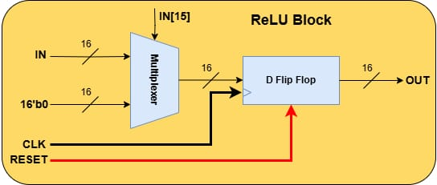
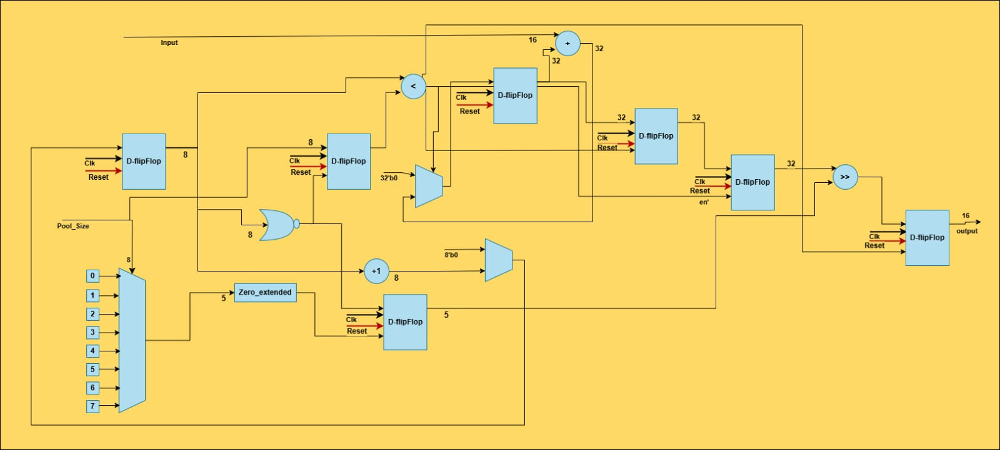
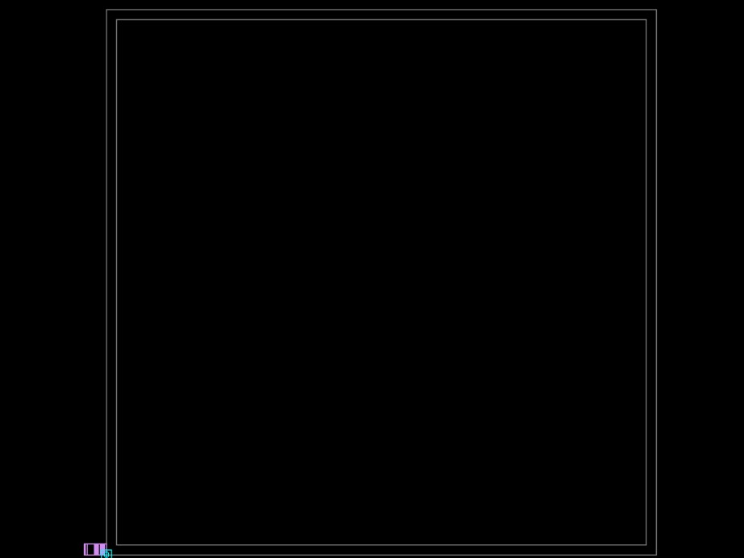
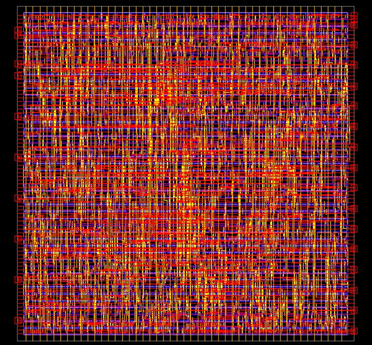
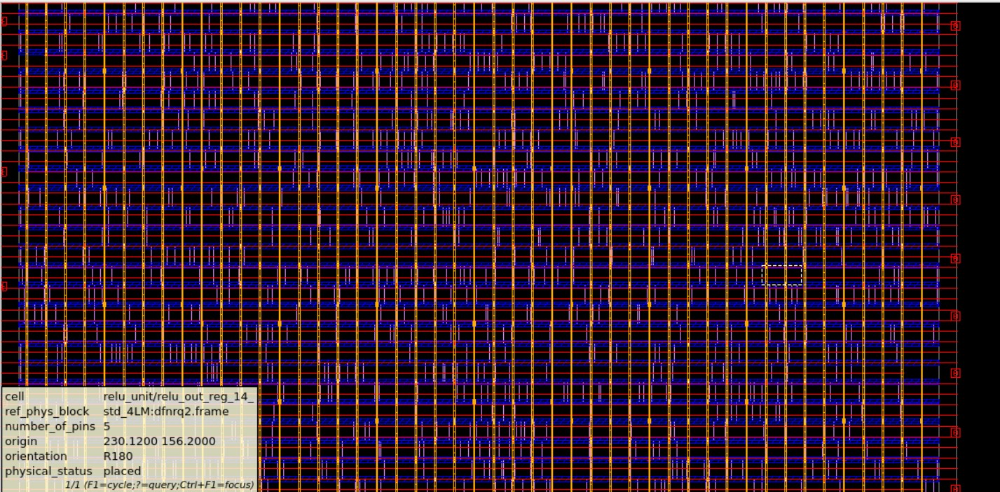
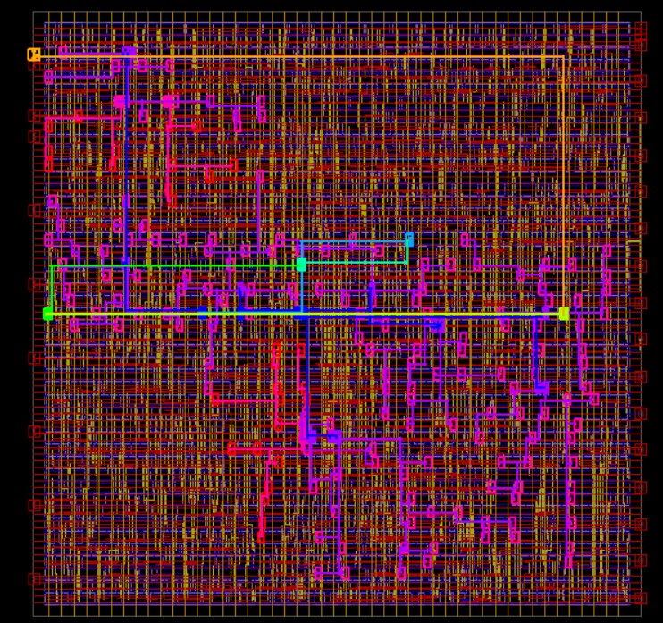
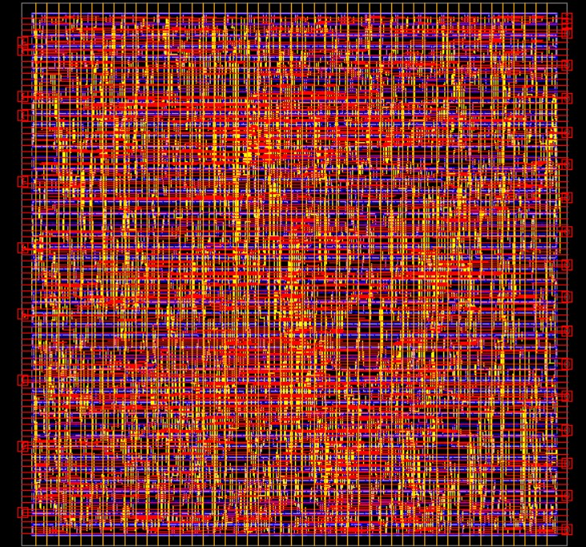

# NNPE RTL and Block-Level Physical Design in 180 nm

This repository presents a cleaned portfolio version of a Neural Network Processing Engine (NNPE) project for 1D-CNN-based PPG signal processing. The design includes synthesizable Verilog RTL, a directed testbench, architecture diagrams, physical-design screenshots, and sanitized implementation summaries.

The NNPE datapath uses modular hardware blocks such as convolution/MAC with fused batch-normalization behavior, ReLU activation, and global average pooling. The public repository focuses on RTL implementation and block-level physical design documentation using a 180 nm physical-design flow.

## Contributors

| Name | Contribution |
|---|---|
| Vivek Vallampatla | RTL contribution, block-level physical design implementation, floorplanning, power planning, placement, CTS, routing checks, timing analysis, and documentation |
| Bharathwaj M. / @bradator1922 | System architecture and RTL design contribution |

> Update the second contributor name/handle before publishing if you want a different display name.

## Project Overview

| Item | Details |
|---|---|
| Project | Neural Network Processing Engine |
| Design top | `NNPE_top_block_shared` |
| Target application | 1D-CNN based PPG signal processing |
| RTL language | Verilog |
| Datapath style | 8-bit input/control data, 16-bit output |
| Main blocks | Conv/MAC, ReLU, Global Average Pooling, FSM control |
| Physical design flow | Floorplan, powerplan, placement, CTS, routing checks |
| Public scope | Sanitized RTL, testbench, images, and summary reports |

## Repository Structure

```text
nnpe-rtl-physical-design-scl180/
├── README.md
├── .gitignore
├── rtl/
│   └── NNPE_top_block_shared.v
├── tb/
│   └── NNPE_top_block_shared_tb.v
├── images/
│   ├── 01_feature_extraction_block_architecture.png
│   ├── 02_nnpe_computation_block.png
│   ├── 03_pipelined_convolution_mac.png
│   ├── 04_relu_activation_block.png
│   ├── 05_global_average_pooling_block.png
│   ├── 06_floorplan.png
│   ├── 07_powerplan.png
│   ├── 08_placement.png
│   ├── 09_clock_tree.png
│   └── 10_final_routed_layout.png
├── reports/
│   ├── synthesis_qor_summary.md
│   ├── post_placement_timing_summary.md
│   ├── placement_congestion_summary.md
│   ├── routing_check_summary.md
│   └── pg_connectivity_note.md
└── docs/
    └── project_notes.md
```

## Architecture

The design is organized as a lightweight NNPE computation chain with reusable hardware modules for convolution/MAC, activation, and pooling.

### Feature Extraction Block



### NNPE Computation Block



### Pipelined Convolution MAC



### ReLU Activation Block



### Global Average Pooling Block



## RTL and Testbench

The RTL top module is:

```verilog
NNPE_top_block_shared
```

The testbench applies directed input cases to verify the control/dataflow behavior of the NNPE top block.

| File | Purpose |
|---|---|
| `rtl/NNPE_top_block_shared.v` | Synthesizable NNPE RTL |
| `tb/NNPE_top_block_shared_tb.v` | Directed simulation testbench |

## Synthesis Summary

| Metric | Value |
|---|---:|
| Design | `NNPE_top_block_shared` |
| Target clock period shown in report | 40.00 ns |
| Critical path length | 12.48 ns |
| Critical path slack | +26.48 ns |
| Setup violating paths | 0 |
| Leaf cell count | 1154 |
| Combinational cells | 973 |
| Sequential cells | 181 |
| Cell area | 2805.00 |
| Design area | 3469.56 |
| Max transition violations | 0 |
| Max capacitance violations | 0 |

Detailed summary: [`reports/synthesis_qor_summary.md`](reports/synthesis_qor_summary.md)

## Physical Design Flow

The block-level physical implementation includes floorplanning, power planning, placement, CTS, routing, and routing verification.

### Floorplan



### Powerplan



### Placement



### Clock Tree / Clock Network View



### Final Routed Layout



## Implementation Checks

| Check | Result |
|---|---|
| Placement congestion snapshot | 9 total overflow, 0.17% GRC overflow |
| Post-placement setup | No setup violations found |
| Post-placement hold | Hold violations observed in intermediate report |
| Routing open nets | 0 |
| Routing DRC violations | 0 |
| Antenna analysis | Not performed because antenna rules were not defined in available setup |

Detailed summaries:

- [`reports/placement_congestion_summary.md`](reports/placement_congestion_summary.md)
- [`reports/post_placement_timing_summary.md`](reports/post_placement_timing_summary.md)
- [`reports/routing_check_summary.md`](reports/routing_check_summary.md)
- [`reports/pg_connectivity_note.md`](reports/pg_connectivity_note.md)

## Notes

This repository is a sanitized public portfolio version. It intentionally excludes foundry files, standard-cell libraries, technology files, tool databases, raw netlists, raw timing databases, GDS/OASIS, SPEF, SDF, and any files containing confidential setup paths.

The available PG connectivity report is kept only as an implementation note because it shows intermediate connectivity issues. The README does not claim final PG signoff.

## Tools Used

- Verilog
- Synopsys Design Compiler
- Synopsys IC Compiler II
- Synopsys PrimeTime-style timing reports

